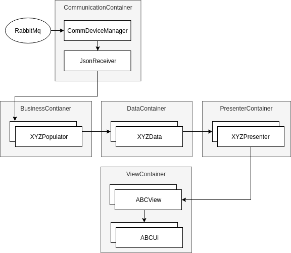
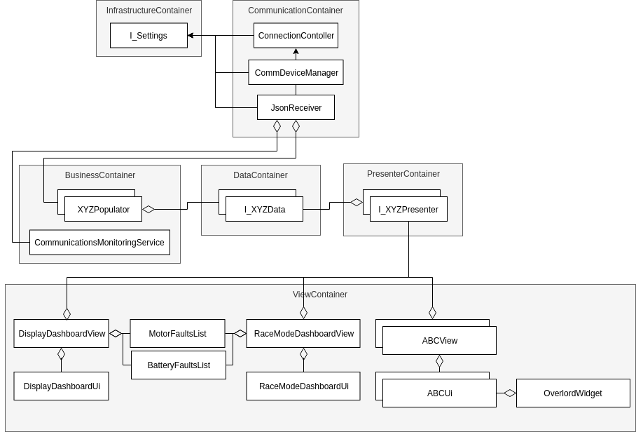

# Epsilon-Dashboard

The Epsilon Dashboard displays information on the screens.

## Project Setup

In this repo, there are dependencies needed for before you will be able to build or run anything.

Before proceding with the installation, contact the Visual Communication leads to get your conan account set up.

To install these dependencies, run the setup script:

`./EpsilonDashboardSetup.sh`

This will install the [RabbitMQ](https://www.rabbitmq.com/) server and the [Conan](https://conan.io/) package manager. See the links for more information.

## Building

### QT Creator

When first setting up your project with QT creator, you must first add a custom step to allow Conan to install dependencies.

1. Navigate to `Projects -> Build`
2. In `Build Steps`, select `Add Build Step -> Custom Process Step`
3. Add the conan command to the step
   - Command: `$HOME/.local/bin/conan`
   - Arguments: `install /path/to/conanfile.txt --build=missing -s compiler.libcxx="libstdc++11"`
   - Working Directory: `%{buildDir}`
4. Move the step to occur as the first step in the process

### Command Line

1. Create a new directory for your build & navigate into it:

    `mkdir build && cd build`

2. If you were running this on the same terminal you ran the setup script on, reload your environment:
   `source ~/.profile`

3. Install conan dependencies:

    `conan install .. --build=missing -s compiler.libcxx="libstdc++11"`

3. Call qmake, passing in the directory with the root `EpsilonDashboard.pro` to generate the makefile:

    `qmake ../src/

- Later, if you need to re-run qmake on the project due to a new UI file or a change to a .pro, call:

    `make qmake_all`

1. Build:

    `make -j4`

## Cross Compilation

First, make sure you have followed the [steps](https://github.com/UCSolarCarTeam/Epsilon-Raspberry/tree/master/cross-compile/README.adoc) to set up a cross compilation environment on your computer.

Cross compiling is the same as the above steps, with a few modifications:

1. You must add an additional `-pr=<path/to/rpi_build>` to the `conan install` command.
   - `conan install /path/to/conanfile.txt --build=missing -pr=/path/tp/rpi_build`
2. When calling qmake, it must be the qmake executed that you compiled for cross-compilation (e.g. `~/raspi/qt5/bin/qmake`).

## Running the Dashboard

### Config file

There must be a `config.ini` beside the execuable to run properly.
An example can be found in `config.ini.example`, and any necessary settings can be updated.

### Switching Modes

There are three different modes for the dashboard: Display mode, Debug Display mode and race mode. The default mode is display mode.
To run the application in different modes, navigate to the directory where you made the executable file for the dashboard.

To run the application in display mode, run the command:
    `./EpsilonDashboard`

To run the application in debug display mode, run the command:
    `./EpsilonDashboard -d`

To run the application in race mode, add the -r flag at the end:
  `./EpsilonDashboard -r`

## Architecture Diagrams

### Data Flow

### Class Diagram

